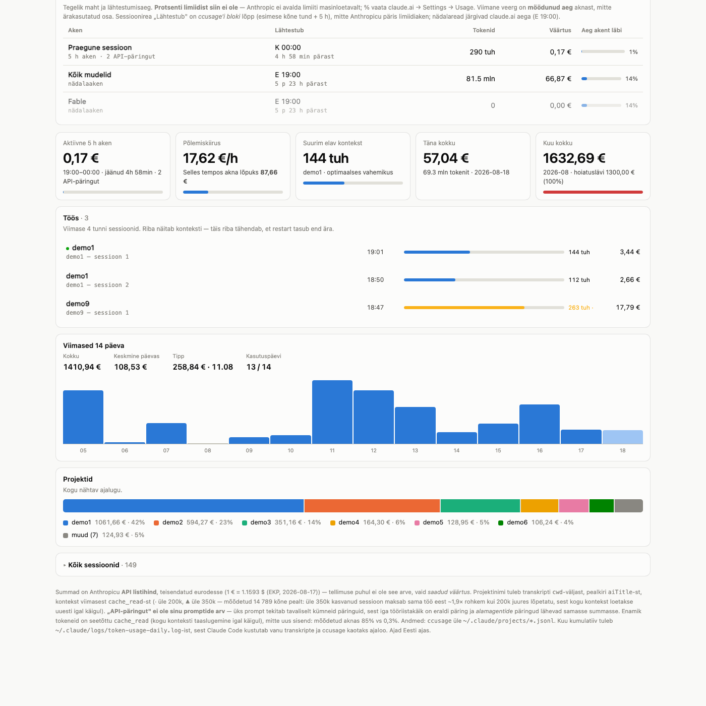

# ccdash

> A local dashboard for Claude Code usage — and a documented account of what `ccusage`
> silently gets wrong.

Built at **[vibetec.eu](https://vibetec.eu)** — AI-orchestrated MVP sprints, idea to
working product in 2–4 weeks.

**[English](#english) · [Eesti](#eesti)**



*Screenshot taken in demo mode (`CCDASH_DEMO=1`): the numbers are real, project and
session names are replaced.*

---

## English

Which project is eating your quota, how bloated your sessions have grown, and what the
month has cost so far. One Python file serves the whole UI; no dependencies beyond the
standard library and `npx ccusage`.

> **Note on language:** the code comments, docstrings and the dashboard UI are in
> Estonian. This README covers the substance in full, so you don't need to read the
> Estonian to understand what the tool knows.

### Why this exists

The dashboard is decoration. The value is in the header of
[`src/ccusage_lib.py`](src/ccusage_lib.py): **three ways `ccusage` silently reports wrong
numbers.** All three were measured, not theorized.

**1. Pricing disappears.** Claude Code's `.jsonl` transcripts contain no `costUSD` field
for subscription usage, so cost is *always* computed from a price table fetched over the
network. When that fetch fails you don't get an error — you get `totalCost: 0` alongside
perfectly normal token counts. That is how a log line reading `$0.00 / 129,759,914 tok`
appeared for a day that actually cost `$99.26`.
→ `fetch()` validates: tokens present but cost zero means broken. It retries `--offline`
(from cache) and only then raises.

**2. Pricing can disappear *partially*** — and this one is nastier. `ccusage` 20.0.19's
built-in offline table was missing `claude-opus-5`: `--offline` reported $1955.45 when the
true figure was $3266.19. A row-total check does not save you, because on a mixed day
(`claude-opus-5` $0.00 + `claude-sonnet-5` $16.16) `totalCost` is non-zero and the check
passes while $237 of usage goes unpriced.
→ `_rows_look_priced()` validates **per model** (`modelBreakdowns`), not per row total.
→ `~/.claude/ccusage.json` supplies the missing prices via `pricingOverrides`; verified
that offline+config matches online to the cent, including cache surcharges.

**3. History is deleted.** Claude Code prunes old transcripts, so historical totals
*shrink over time* — one month read $2606 when logged and $2187 a few weeks later. You
therefore cannot compute a month-to-date total from `ccusage`; it has to be summed from
your own log.
→ see `month_total_from_log()` and the daily logger below.

On top of that, `check_pricing_drift()` compares your price overrides against the LiteLLM
table and warns when they diverge — comparing each model against **its own** entry, with a
fallback anchor only for models LiteLLM doesn't know yet.

### Install

Requirements: macOS, Python 3.11+, Node (`npx`), optionally Google Chrome (for the app
window).

```bash
git clone https://github.com/vibetec-eu/ccdash.git ~/dev/ccdash
cd ~/dev/ccdash && ./install.sh
```

`install.sh` symlinks the code into `~/.claude/scripts/`, installs two launchd jobs
(`eu.vibetec.ccdash`, `eu.vibetec.token-usage-daily`) and starts the server. **It
overwrites nothing** — if a target exists and isn't a symlink into this repo, it stops and
tells you what's in the way.

> ⚠️ If you already have ccdash installed by hand (real files, not symlinks, under
> `~/.claude/scripts/`), **don't run `install.sh`** — replace those files with symlinks
> yourself, or keep what you have. The script is meant for a fresh clone.

Removal: `./uninstall.sh` — your log and config are kept.

### Configuration

`~/.claude/ccdash.config.json`, sample in
[`examples/ccdash.config.json`](examples/ccdash.config.json). Every field is optional.

| Field | Effect |
|---|---|
| `projectRoots` | Directories whose subdirectories are projects. **List every tree** where your projects live. |
| `timezone` | Day-boundary grouping. Defaults to the system zone. |
| `thresholds.monthEur` | Monthly warning threshold shown on the dashboard (EUR). |
| `thresholds.dayUsd` / `monthUsd` | Thresholds for the daily logger's macOS notification (USD). |

**Why `projectRoots` has to be listed by hand.** Claude Code stores transcripts in a
directory named after a slug of the working path: `/Users/x/Projects/web` becomes
`-Users-x-Projects-web`. That transform is **not reversible** — `.` and `@` also become
hyphens, so a hyphen could have been `/`, `.`, `@` or a real hyphen. ccdash therefore reads
the project from the transcript's `cwd` field, which requires knowing which paths are
project roots. Deriving them from the home directory does not work.

### Usage

```bash
~/.claude/scripts/ccdash                 # server + browser
~/.claude/scripts/ccdash-open            # Chrome app window (separate profile)
CCDASH_DEMO=1 ~/.claude/scripts/ccdash   # demo mode, see below
python3 src/token_usage_daily.py --dry-run   # print today's log line without writing
```

The server is lazy: if nobody polls it, it sleeps and never invokes `ccusage`. That's why
it is safe to keep it under launchd permanently.

**Demo mode.** `CCDASH_DEMO=1` replaces project names with `demo1…demoN` (ordered by cost,
so numbering is stable) and session titles with generic ones. Costs, tokens and timestamps
stay real. Meant for screenshots and presentations — session titles come from the `aiTitle`
field and are free-form sentences about real work.

**Daily logger** (launchd, 09:00) appends a line to
`~/.claude/logs/token-usage-daily.log`. That file is the **only durable usage history** —
`ccusage` loses old days and they cannot be reconstructed. Don't delete it, and don't try
to "rebuild it from `ccusage`".

### What it does not do

- **No percentage of your limit.** Anthropic does not publish the limit anywhere
  machine-readable (checked: transcripts, logs, caches, `~/.claude.json`). ccdash shows
  actual volumes and reset times instead. For the percentage: claude.ai → Settings → Usage.
- **Not cross-platform.** launchd, `osascript` notifications and the Chrome app window are
  macOS-specific. The server itself (`python3 src/ccdash.py --port 8787`) runs anywhere.
- **Sends nothing anywhere.** Everything stays on your machine; the network is touched only
  for the ECB exchange rate, the LiteLLM price table and `npx`.

### Who made this

[vibetec.eu](https://vibetec.eu) — a mini-accelerator: an idea owner without a dev team
gets a working product in 2–4 weeks, built by an AI-orchestrated team. ccdash is a
by-product of measuring what that actually costs.

MIT.

---

## Eesti

Milline projekt sinu kvooti sööb, kui suureks on sessioonid paisunud ja kui palju kuu seni
maksnud on. Üks Pythoni fail serveerib kogu HTML-i; sõltuvusi peale standardteegi ja
`npx ccusage` ei ole.

### Miks see olemas on

Dashboard ise on kaunistus. Väärtus on [`src/ccusage_lib.py`](src/ccusage_lib.py) päises:
**kolm viisi, kuidas `ccusage` vaikselt valesid numbreid annab** — kõik kolm mõõdetud,
mitte teoreetilised.

**1. Hinnakiri kaob.** Claude Code'i `.jsonl`-id ei sisalda tellimuskasutuse puhul
`costUSD` välja, seega kulu arvutatakse **alati** võrgust tõmmatud hinnatabelist. Tõmbe
ebaõnnestumisel ei tule viga — tuleb `totalCost: 0` ja täiesti normaalsed tokeninumbrid.
Nii tekkis logisse rida `$0.00 / 129 759 914 tok` päeva kohta, mis päriselt maksis $99.26.
→ `fetch()` valideerib: tokeneid on, aga kulu null = katki. Proovib `--offline`
(vahemälust) ja alles siis annab vea.

**2. Hinnakiri võib kaduda OSALISELT** — ja see on salakavalam. `ccusage` 20.0.19
sisseehitatud offline-tabelis puudus `claude-opus-5`: `--offline` andis $1955.45, õige oli
$3266.19. Rea kogusumma kontroll ei päästa, sest segapäeval (`claude-opus-5` $0.00 +
`claude-sonnet-5` $16.16) on `totalCost` nullist erinev — kontroll läheb läbi ja $237 jääb
hinnastamata.
→ `_rows_look_priced()` kontrollib **mudelite kaupa** (`modelBreakdowns`), mitte rea summat.
→ `~/.claude/ccusage.json` annab puuduvad hinnad `pricingOverrides` kaudu; kontrollitud, et
offline+config ühtib online'iga sendi täpsusega, sh vahemälu lisatasud.

**3. Ajalugu kustub.** Claude Code koristab vanu transkripte, nii et ajaloolised summad
**kahanevad ajas** — üks kuu oli logi järgi $2606 ja paar nädalat hiljem näitas `ccusage`
$2187. Kuu summat ei tohi seepärast `ccusage`'ist arvutada; see tuleb liita oma logist.
→ vt `month_total_from_log()` ja päevalogijat allpool.

Lisaks võrdleb `check_pricing_drift()` sinu hinnaülekirjutusi LiteLLM-i tabeliga ja
hoiatab, kui need lahku lähevad. Võrdlus käib mudeli **enda** kirje vastu; ankrut
kasutatakse ainult mudelil, mida LiteLLM veel ei tunne.

### Paigaldus

Nõuded: macOS, Python 3.11+, Node (`npx`), soovi korral Google Chrome (äpiaken).

```bash
git clone https://github.com/vibetec-eu/ccdash.git ~/dev/ccdash
cd ~/dev/ccdash && ./install.sh
```

`install.sh` teeb symlingid `~/.claude/scripts/` alla, paigaldab kaks launchd-jobi
(`eu.vibetec.ccdash`, `eu.vibetec.token-usage-daily`) ja käivitab serveri. **Ta ei kirjuta
midagi üle** — kui mõni fail on juba olemas ja ei ole symlink sellesse repo, ta peatub ja
ütleb, mis takistab.

> ⚠️ Kui sul on ccdash juba käsitsi paigaldatud (päris failid, mitte symlingid
> `~/.claude/scripts/` all), **ära jooksuta `install.sh`** — asenda failid ise
> symlinkidega või jäta vanad alles. Skript on värske klooni jaoks.

Eemaldus: `./uninstall.sh` — logi ja seadistus jäävad alles.

### Seadistus

`~/.claude/ccdash.config.json`, näidis
[`examples/ccdash.config.json`](examples/ccdash.config.json). Kõik väljad on valikulised.

| Väli | Mida teeb |
|---|---|
| `projectRoots` | Kaustad, mille alamkaustad on projektid. **Loetle kõik puud**, kus projektid elavad. |
| `timezone` | Päevade grupeerimine. Puudumisel süsteemi oma. |
| `thresholds.monthEur` | Kuu hoiatuslävi dashboardil (EUR). |
| `thresholds.dayUsd` / `monthUsd` | Päevalogija macOS-teate läved (USD). |

**Miks `projectRoots` tuleb käsitsi loetleda.** Claude Code hoiab transkripte kaustanime
järgi, kus teest on tehtud slug: `/Users/x/Projects/veeb` → `-Users-x-Projects-veeb`.
Teisendus **ei ole pööratav** — sidekriipsuks muutuvad ka `.` ja `@`, seega tagasi ei saa.
Seepärast loeb ccdash projekti transkripti `cwd`-väljast ja peab teadma, millised teed on
projektijuured. Nende tuletamine kodukaustast ei tööta.

### Kasutus

```bash
~/.claude/scripts/ccdash                 # server + brauser
~/.claude/scripts/ccdash-open            # Chrome'i äpiaken (eraldi profiil)
CCDASH_DEMO=1 ~/.claude/scripts/ccdash   # demo-režiim, vt allpool
python3 src/token_usage_daily.py --dry-run   # päevarida, ilma kirjutamata
```

Server on laisk: kui keegi ei polli, ta magab ega jooksuta `ccusage`'it. Just seetõttu on
turvaline hoida teda launchd all kogu aeg.

**Demo-režiim.** `CCDASH_DEMO=1` asendab projektinimed `demo1…demoN` (kulu järjekorras,
seega nummerdus on stabiilne) ja sessioonipealkirjad üldistega. Kulud, tokenid ja ajad
jäävad päris. Mõeldud ekraanipildi või esitluse jaoks — sessioonipealkirjad tulevad
`aiTitle` väljast ja on vabas vormis laused päris tööst.

**Päevalogi.** launchd kirjutab iga päev kell 9 ühe rea faili
`~/.claude/logs/token-usage-daily.log`.
See on **ainus püsiv kasutusajalugu** — `ccusage` kaotab vanad päevad ja neid ei saa
taastada. Ära kustuta seda faili ega "ehita uuesti üles".

### Mida see EI tee

- **Ei näita protsenti limiidist.** Anthropic ei avalda limiiti üheski masinloetavas kohas
  (kontrollitud: transkriptid, logid, vahemälu, `~/.claude.json`). ccdash näitab tegelikke
  mahtusid ja lähtestamisaegu. Protsent: claude.ai → Settings → Usage.
- **Ei ole mitmeplatvormiline.** launchd, `osascript`-teated ja Chrome'i äpiaken on macOS-i
  omad. Server ise (`python3 src/ccdash.py --port 8787`) töötab igal pool.
- **Ei saada andmeid kuhugi.** Kõik jääb masinasse; võrku läheb ccdash ainult EKP kursi,
  LiteLLM-i hinnatabeli ja `npx` pärast.

### Kes tegi

[vibetec.eu](https://vibetec.eu) — minikiirendi: idee omanik ilma dev-tiimita saab töötava
toote 2–4 nädalaga, selle ehitab AI-orkestreeritud tiim. ccdash sündis kõrvalsaadusena
selle mõõtmisest, mis see päriselt maksab.

MIT.
